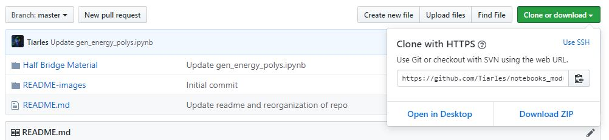
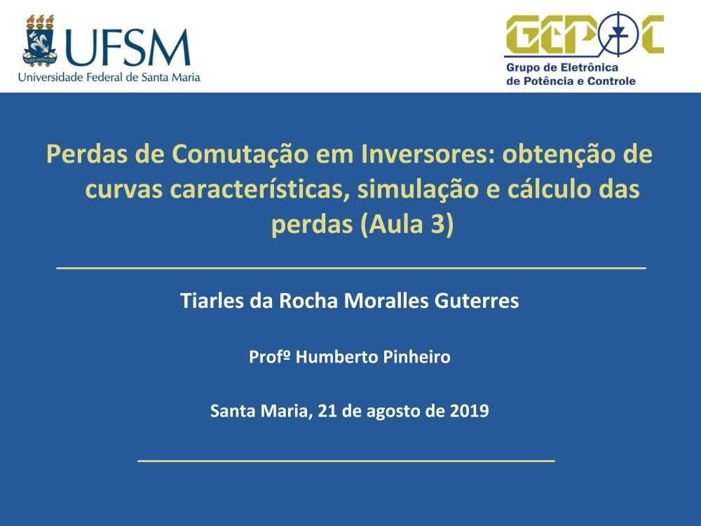
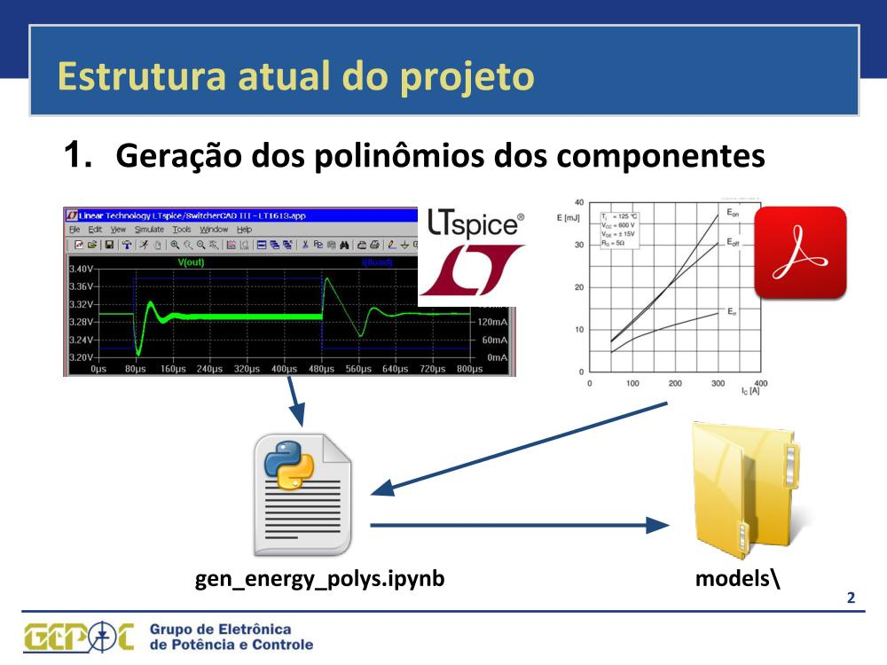
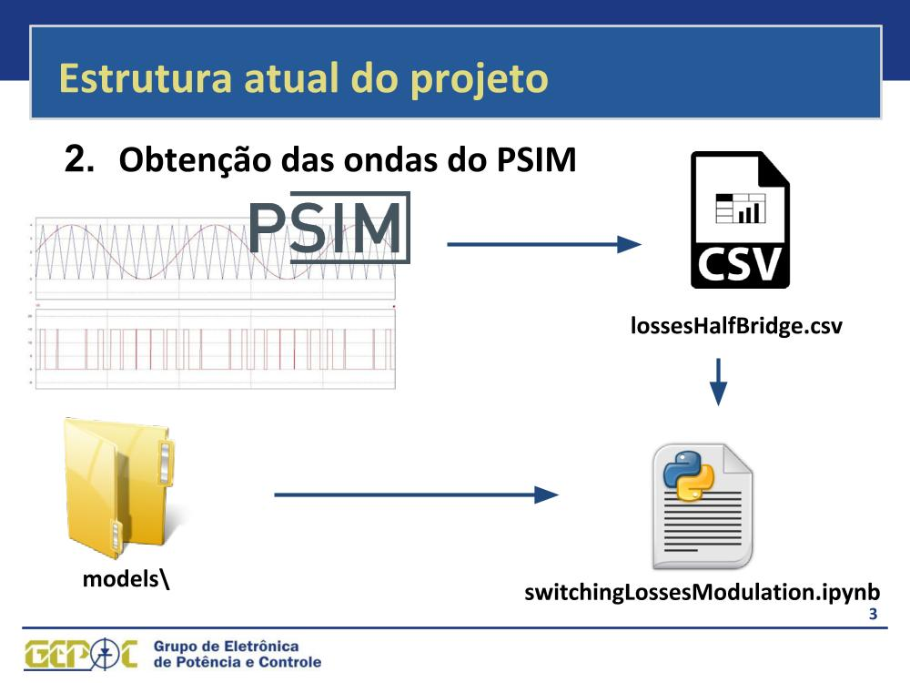

# Material da disciplina de Sistemas de modulação para conversores estáticos 
alimentados de tensão

**Prof º** Humberto Pinheiro
**Autor e gerenciador do repositório:** Tiarles Guterres 
([github.com/tiarles](github.com/tiarles))

Até o dia 27 de agosto de 2019 o material do repositório se encontra dividido 
da seguinte forma:

1. Na pasta ``Half Bridge Material`` encontra-se três notebooks e um módulo 
python: O módulo (**halfBridgeModule**) possui algumas funções como a 
**tabela de perdas em condução** e **em comutação** para o inversor 2 níveis 
que são utilizadas nos notebooks **conductionLossesModulation.ipynb** e 
**switchingLossesModulation**.

2. Na pasta ``Filter Design Material`` encontra-se um notebook e um pdf:
O notebook (**filter design-rev02.ipynb**) contém alguns comandos mostrados 
em aula pelo profº Humberto e um pdf 
(**180724 - Modulation rev10_april_23_2019.pdf**) que fala sobre o projeto do 
filtro mostrado no notebook.

**Como faz para utilizar os arquivos no repositório?** Você pode baixar todos 
os arquivos desta página, clicando em ``Clone or download`` e após em 
``Download ZIP``.

Os slides abaixo mostram o funcionamento dos arquivos presentes na pasta
``Half Bridge Material``:

